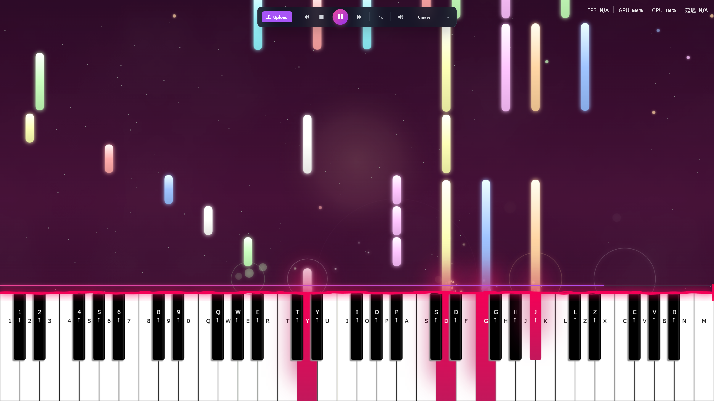

# 🎹 Virtual Piano (Updated in 2026)

> **🎮 [▶️ Play Now at tako-piano.netlify.app](https://tako-piano.netlify.app/)**



<!-- Add screenshot here:  -->
<!-- To add a screenshot: Create a 'screenshots' folder in the root and add your screenshot as 'demo.png' -->

An interactive web-based piano application with MIDI playback, real-time visual effects, and Salamander Grand Piano samples. Play songs automatically, control playback speed, or play manually with your keyboard.

   

## ✨ Features

### 🎵 Audio & Playback
- **Professional Piano Samples**: Salamander Grand Piano with 15 strategically sampled notes
- **Tone.js Audio Engine**: Web Audio API-based synthesis with natural pitch-shifting
- **Variable Speed Control**: 0.5x to 2x playback speed (0.5x, 0.75x, 1x, 1.25x, 1.5x, 2x)
- **Volume Control**: Animated vertical slider with logarithmic volume curve (0-100%)
- **Interactive Progress Bar**: Click anywhere to jump to that position in the song
- **Precise Time Control**: Forward/rewind 10 seconds with instant response
- **Background Playback**: Audio continues playing even when tab is inactive

### 🎨 Visual Effects
- **Gradient Falling Notes**: Color-wheel gradient bubbles with lighten/darken effects
- **Smoke Particles**: Subtle particle trails when notes hit keys
- **Electric Sparks**: 8-12 spark particles with upward hemisphere trajectories
- **Key Glow Effects**: 300ms fade with colored shadow effects on key press
- **Real-time Rendering**: Canvas-based 60 FPS rendering

### 🎮 Controls & Interaction
- **Dynamic Island Control Panel**: Apple-inspired floating control center
- **Sheet Music Selection**: Pre-loaded songs with dropdown selector
- **Custom MIDI Upload**: Upload your own MIDI files for playback
- **Keyboard Support**: Play piano with computer keyboard (mapped to keys)
- **Mouse/Touch Support**: Click or tap piano keys directly

### 📊 Built-in Songs
- Unravel
- Flower Dance
- Luv Letter
- My War
- Senbonzakura

## 🏗️ Technical Architecture

### Frontend Stack
- **Vue 3**: Composition API with `<script setup>` syntax
- **TypeScript**: Fully typed codebase with strict mode
- **Vite**: Lightning-fast build tool with HMR
- **TailwindCSS**: Utility-first styling with custom animations
- **Canvas API**: High-performance 2D rendering

### Audio System
```
Tone.js Sampler Configuration:
├── 15 Sample Points (C1, F1, C2, F2, C3, F3, C4, E4, F4, A4, C5, F5, G5, C6, C7)
├── Attack: 0.16s (natural piano attack)
├── Release: 1s (sustain and decay)
├── Volume: -8 dB (optimal mixing level)
└── Source: OnlinePianist CDN (Salamander Grand Piano samples)
```

**Why only 15 samples?** Tone.js automatically pitch-shifts between sample points, providing natural sound across all 88 keys while keeping bundle size minimal.

### Timing System
**Single Source of Truth Design:**
```typescript
playbackTime (ref<number>)  // Current position in milliseconds
    ↓
calculateBubbles()          // Pure function: recalculates positions each frame
    ↓
playNotesInTimeRange()      // Triggers notes within time window
```

This architecture enables:
- ✅ Instant seeking without note stomping
- ✅ Perfect sync between audio and visuals
- ✅ Clean pause/resume/rewind functionality
- ✅ No cumulative timing drift

### Project Structure
```
src/
├── components/
│   └── PianoCanvas.vue       # Main application component
├── services/
│   ├── toneAudio.ts          # Tone.js Sampler service
│   ├── pianoEngine.ts        # Piano logic & audio interface
│   └── midiUploader.ts       # MIDI file parsing
├── types/
│   └── piano.ts              # TypeScript interfaces
├── data/
│   └── sheets/               # Pre-loaded MIDI data (JSON)
├── assets/                   # Static assets
├── main.ts                   # App entry point
├── App.vue                   # Root component
└── style.css                 # Global styles
```

## 🚀 Getting Started

### Prerequisites
- Node.js 18+ 
- npm or yarn

### Installation

```bash
# Clone the repository
git clone https://github.com/takosenpai2687/virtual-piano.git
cd virtual-piano

# Install dependencies
npm install

# Start development server
npm run dev

# Build for production
npm run build

# Preview production build
npm run preview
```

### Development Server
Opens at `http://localhost:5173` (or next available port)

## 🎹 How to Use

### Playing Songs
1. Click the **sheet music dropdown** in the Dynamic Island
2. Select a pre-loaded song or upload your own MIDI file
3. Press the **Play button** ▶️
4. Use **speed control** to adjust playback tempo
5. Click the **progress bar** to seek to any position

### Manual Playing
- **Computer Keyboard**: Keys are mapped to piano notes
- **Mouse**: Click piano keys directly
- **Touch**: Tap keys on mobile devices

### Playback Controls
| Button | Function |
|--------|----------|
| ▶️ | Play/Pause toggle |
| ⏹️ | Stop (reset to beginning) |
| ⏪ | Rewind 10 seconds |
| ⏩ | Forward 10 seconds |
| 🎵 | Select sheet music / Upload MIDI |
| 🔊 | Volume control (0-100%) with animated slider |
| 0.5x - 2x | Playback speed selector |

## 🌐 Deployment

### Netlify (Recommended)
The project includes Netlify configuration:

```bash
# Automatic deployment (connect to GitHub)
1. Push to GitHub
2. Connect repository to Netlify
3. Build settings are pre-configured in netlify.toml

# Manual deployment
npm run build
netlify deploy --prod --dir=dist
```

### Other Platforms
Build output is in `dist/` - deploy as static site on:
- Vercel
- GitHub Pages
- AWS S3
- Cloudflare Pages

## 🎨 Customization

### Adding New Songs
1. Export MIDI file as JSON using `midiUploader.ts`
2. Place JSON in `src/data/sheets/`
3. Add to `sheets` array in `PianoCanvas.vue`

### Changing Colors
Modify `COLOR_WHEEL` in `src/types/piano.ts`:
```typescript
export const COLOR_WHEEL = [
  "#ffadad", "#ffd6a5", "#fdffb6", 
  "#caffbf", "#9bf6ff", "#a0c4ff", 
  "#bdb2ff", "#ffc6ff", "#fffffc"
];
```

### Audio Settings
Edit `src/services/toneAudio.ts`:
```typescript
this.sampler = new Tone.Sampler({
  attack: 0.16,    // Note attack time
  release: 1,      // Note decay time
  volume: -8,      // Master volume (dB)
  // ... sample URLs
});
```

**Volume Control**: Uses logarithmic scale for natural volume perception:
- Linear input (0-1) → Logarithmic output (-60dB to 0dB)
- Default: 0.7 (70%) = -18dB
- Muted: 0 = -∞dB

## 🔧 Performance Optimizations

- **Canvas Rendering**: 60 FPS with requestAnimationFrame
- **Particle Limits**: Maximum 100 smoke + 200 spark particles
- **Pure Functions**: `calculateBubbles()` has no side effects
- **Lazy Loading**: MIDI files loaded on demand
- **CDN Assets**: Audio samples served from OnlinePianist CDN
- **Code Splitting**: Automatic chunking via Vite

## 📝 Browser Support

- Chrome/Edge 90+
- Firefox 88+
- Safari 14+
- Mobile browsers with Web Audio API support

**Note**: Web Audio API requires user interaction before playing sound (browser security policy).

## 🐛 Known Issues

- [ ] Mobile keyboard input not supported (virtual keyboard interferes)
- [ ] Very large MIDI files (>10MB) may cause performance issues
- [ ] Safari on iOS requires tap to start audio context

## 🤝 Contributing

Contributions welcome! Please:
1. Fork the repository
2. Create a feature branch (`git checkout -b feature/amazing-feature`)
3. Commit changes (`git commit -m 'Add amazing feature'`)
4. Push to branch (`git push origin feature/amazing-feature`)
5. Open a Pull Request

## 📄 License

This project is licensed under the MIT License - see [LICENSE](LICENSE) file for details.

## 🙏 Acknowledgments

- **Salamander Grand Piano**: High-quality piano samples by Alexander Holm
- **Tone.js**: Web Audio framework by Yotam Mann
- **OnlinePianist**: Hosting of Salamander samples
- **Font Awesome**: Icon library for UI controls

## 📞 Contact

- GitHub: [@takosenpai2687](https://github.com/takosenpai2687)
- Project: [github.com/takosenpai2687/virtual-piano](https://github.com/takosenpai2687/virtual-piano)

---

**Made with ❤️ and Vue 3**

*Experience professional piano sound quality with cutting-edge web audio technology.*
