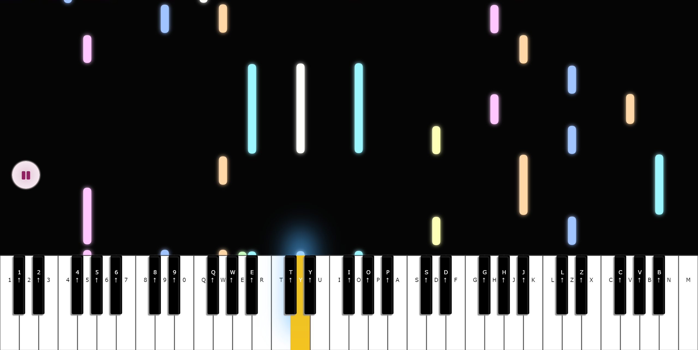
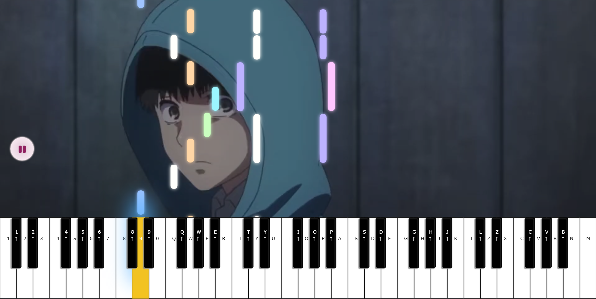

# virtual-piano

A Synthesia inspired web piano player with autoplay support.

## How to play

Play with mouse or keyboard.

Press while holding Left Shift ⇧ to play Black Keys.

## Autoplay Sample Music

Press SPACE or click the autoplay button to toggle play/pause sample music. You can play along with it if you want~

## >>>>> CLICK [HERE](https://takosenpai2687.github.io/virtual-piano/) TO PLAY ONLINE <<<<<

## Screenshots

